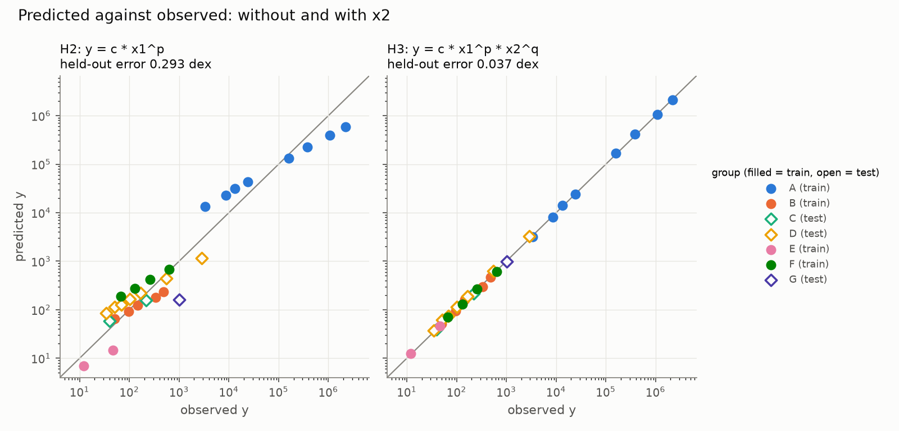

# AI Co-Scientist Demo: Finding a Law in Noisy Data

A short, hands-on walk through an AI-assisted research workflow: propose
hypotheses, gather evidence, test the hypotheses, write the paper. Built for
UC Berkeley students with no paid AI plan.

## The idea

- **Task.** Given 29 noisy measurements of three unnamed quantities (`x1`,
  `x2`, `y`), find the law that links them and show that it holds for groups
  it never saw.
- **Blind.** The AI is not told what the data are. Names are hidden, units are
  scrambled and noise is added, so the law must be fitted and tested. It
  cannot be recited from memory.
- **Reveal.** The data are real orbits. The law is Kepler's third law with
  Newton's mass term, `T = 2π √(a³ / GM)`, and the final paper checks the
  blind result against Galileo (1610), Kepler (1619) and Newton (1687).

## Quick start

Requires [uv](https://docs.astral.sh/uv/). No API key needed.

```bash
git clone https://github.com/KurtSoncco/ai-coscientist-demo.git
cd ai-coscientist-demo
uv sync          # creates .venv/ with the locked dependencies
./run_all.sh     # all offline stages, a few seconds
```

This writes the results to `results/` and a paper to `paper/report.md`.
Finished examples are in [`paper/`](paper/).

## The four stages

| Stage | Question | AI tool | No-key fallback |
| --- | --- | --- | --- |
| 1. Hypotheses | What could the law be? | [Open Coscientist](https://github.com/jataware/open-coscientist) | Prompts by hand in a chat app |
| 2. Evidence | Which formula predicts unseen groups? | [OpenEvolve](https://github.com/algorithmicsuperintelligence/openevolve) | `mini_evolve.py` |
| 3. Tests | Is the evidence strong enough? | None: plain statistics | Always offline |
| 4. Paper | How does it compare with the literature? | [OpenScience](https://github.com/synthetic-sciences/openscience) | `make_paper.py` |

Stages 1 to 3 are blind. Stage 3 ends by opening the key. Stage 4 is
unblinded and uses the old papers in [`literature/`](literature/README.md).

### Stage 1: Hypotheses

Agents generate, review, rank (Elo tournament) and refine formulas.

```bash
export OPENAI_API_KEY=your-key
uv run python 01_hypotheses/run_coscientist.py --model gpt-4.1-mini
```

No key: follow [`01_hypotheses/prompts.md`](01_hypotheses/prompts.md).

### Stage 2: Evidence

An LLM rewrites a Python function, `fit(train_rows) -> predict(x1, x2)`, and
keeps the versions that score better on held-out groups.

```bash
uv run openevolve-run 02_openevolve/initial_program.py 02_openevolve/evaluator.py \
  --config 02_openevolve/config.openai.yaml --iterations 30
```

No key: `uv run python 02_openevolve/mini_evolve.py`

### Stage 3: Hypothesis tests and reveal

```bash
uv run python 03_tests/hypothesis_tests.py
```

Compares four hypotheses, puts bootstrap intervals on the exponents, tests
whether `x2` matters, then opens the key and estimates G.

### Stage 4: The paper

```bash
uv run python 04_paper/make_paper.py        # template paper, no key
```

With OpenScience, an agent writes the paper itself: see
[`04_paper/goal.md`](04_paper/goal.md).

## Results

From Stage 3, on the committed data:

| Hypothesis | Formula | Held-out error (dex) |
| --- | --- | --- |
| H1 | `y = c * x1` | 0.245 |
| H2 | `y = c * x1^p` (Kepler's form, no mass) | 0.293 |
| H3 | `y = c * x1^p * x2^q` | 0.037 |
| H4 | `y = c * x1^(3/2) * x2^(-1/2)` (Newton's form) | 0.036 |

- **Exponents:** p = 1.506 and q = −0.507. Their 95% intervals contain 3/2
  and −1/2.
- **Mass matters:** p = 1.3e-09 on a test with one point per group.
- **G:** 7.256e-11, which is 8.7% above the accepted 6.674e-11.
- **A lesson in uncertainty:** the interval for G from resampling rows,
  [6.899e-11, 7.630e-11], misses the accepted value. Resampling whole groups
  gives [6.591e-11, 7.892e-11], which contains it. Rows that share one mass
  estimate are not independent.



## What the AI tools did in our test runs

One run each, with an OpenAI key.

| Stage | Model | Outcome |
| --- | --- | --- |
| 1. Open Coscientist | `gpt-4.1-mini` | Completed in 96 s. Its top-ranked hypotheses were elaborate power laws with the wrong sign on the `x2` exponent (+0.5; the data say −0.5). |
| 2. OpenEvolve | `gpt-4o-mini` | Score rose from 0.803 to 0.964: a least-squares power law fitted from the data, as good as H3. Only 10 of 30 iterations ran because of a rate limit. |
| 4. OpenScience | `gpt-4.1-mini` | Wrote a full paper in 40 s. Tables were correct, but it had six errors, including the headline one. Audit in [`paper/README.md`](paper/README.md). |

The pattern is the point of the demo: debate ranked a wrong hypothesis first,
the held-out score found the right one, and the fluent write-up still needed
checking line by line.

## Using another provider

| Provider | Key variable | Stage 1 `--model` | Stage 2 `--config` |
| --- | --- | --- | --- |
| Gemini (free tier) | `GEMINI_API_KEY` | `gemini/gemini-2.5-flash` | `02_openevolve/config.yaml` |
| OpenAI (paid) | `OPENAI_API_KEY` | `gpt-4.1-mini` | `02_openevolve/config.openai.yaml` |
| Anthropic (paid) | `ANTHROPIC_API_KEY` | `anthropic/claude-haiku-4-5-20251001` | `02_openevolve/config.anthropic.yaml` |

Only OpenAI has been run so far. `run_all.sh` uses whichever key is exported.
Never commit a key.

## Repo layout

```
data/            orbits.csv (real), make_dataset.py, observations.csv (what the AI sees), key.json
01_hypotheses/   run_coscientist.py, prompts.md
02_openevolve/   initial_program.py, evaluator.py, config*.yaml, mini_evolve.py
03_tests/        hypothesis_tests.py
04_paper/        goal.md (OpenScience), make_paper.py
literature/      Galileo 1610, Kepler 1619, Newton 1687: citations and quotations
paper/           example papers and the audit of the AI-written one
run_all.sh       every stage in order
```

## Rules for using AI co-scientists

- **The evaluator is the science.** Evolution only optimizes what you measure.
- **Check whether it discovered or remembered.** With real names and units,
  the model wrote Kepler's law with the textbook G on its first try.
- **Use the uncertainty that matches the data.**
- **Verify every citation and number.** Open the source; rerun the code.
- **Keep unpublished data off free tiers.**
- **Disclose AI use.** You own every claim.

## Troubleshooting

| Symptom | Fix |
| --- | --- |
| `uv: command not found` | Install uv: `curl -LsSf https://astral.sh/uv/install.sh \| sh` |
| HTTP 429, "requests per day" | Rate limit. New OpenAI accounts can be capped at 50 requests a day per model. Wait, switch model, or use the fallback. |
| HTTP 429, "no credits remaining" | Add credits on the provider's billing page. |
| Anthropic 400, "not scoped to a workspace" | Create the key inside a workspace in the Anthropic Console. |
| `ImportError` from `mcp` | Install with `uv sync`, which pins `mcp<2`. |

## Sources and licences

- `data/orbits.csv`: NASA planetary and satellite fact sheets. Every row
  agrees with Kepler's law to within 1%.
- `literature/`: public-domain editions, linked there.
- Open Coscientist: MIT with Commons Clause. OpenEvolve and OpenScience:
  Apache 2.0.
